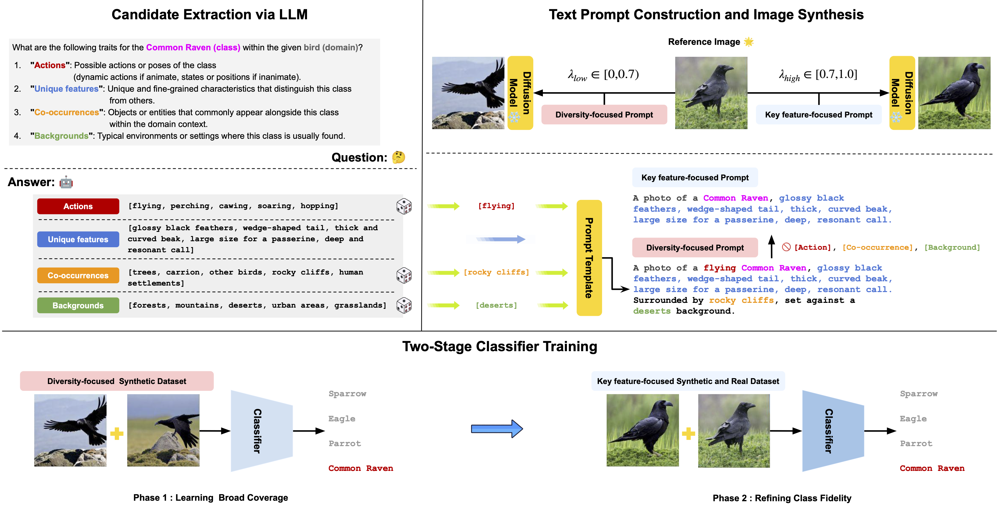

# CABIN: Controlling Augmentations for Balancing Invariance and Diversification in One-Shot Image Classification

<div align="center">
    
</div>

## Installation
```bash
# Create a virtual environment and install dependencies
conda create -n cabin python=3.10.16
conda activate cabin
pip install -r requirements.txt

# Download IP-Adpater models
git lfs install
git clone https://huggingface.co/h94/IP-Adapter
mv IP-Adapter/models models
```

## Datasets
<details>
<summary><strong>Commands to download datasets</strong></summary>

- Download the Oxford Pets dataset
```bash
wget https://thor.robots.ox.ac.uk/~vgg/data/pets/images.tar.gz
wget https://thor.robots.ox.ac.uk/~vgg/data/pets/annotations.tar.gz
tar -xvf images.tar.gz
tar -xvf annotations.tar.gz
mv images oxford_pet
mv annotations oxford_pet
```

- Download the Caltech101 dataset
    - Download the dataset from the following link: [Caltech101](https://data.caltech.edu/records/mzrjq-6wc02)
    - Arrange the dataset in the following folder structure:
    ```plain
    - datasets
        - caltech-101
            - 101_ObjectCategories
                - accordion
                    - image_0001.jpg
                    - image_0002.jpg
                - airplanes
                    - image_0001.jpg
                    - image_0002.jpg
                - ...
    ```

- Download the Flowers102 dataset
```bash
wget https://www.robots.ox.ac.uk/~vgg/data/flowers/102/102flowers.tgz
wget https://www.robots.ox.ac.uk/~vgg/data/flowers/102/imagelabels.mat
tar -xvf 102flowers.tgz
mv jpg flowers102/jpg
mv imagelabels.mat flowers102/imagelabels.mat
```

- Download the EuroSAT dataset
```bash
mkdir eurosat
cd eurosat
curl -O http://madm.dfki.de/files/sentinel/EuroSAT.zip
wget https://drive.usercontent.google.com/u/0/uc\?id\=1Ip7yaCWFi0eaOFUGga0lUdVi_DDQth1o\&export\=download -O split_zhou_EuroSAT.json
unzip EuroSAT.zip
```

- Download the CUB200 dataset
```bash
wget https://data.caltech.edu/records/65de6-vp158/files/CUB_200_2011.tgz
tar -xvzf CUB_200_2011.tgz
rm -rf CUB_200_2011.tgz
```

- Download the Food101 dataset
```bash
wget https://data.vision.ee.ethz.ch/cvl/food-101.tar.gz
tar -xvzf food-101.tar.gz
rm -rf food-101.tar.gz
```

</details>

## Candidate Extraction via LLM

To produce candidate prompts using an LLM (we utilized GPT-4o), please configure the environment and execute the designated script. Follow the steps below to get started:

1. **Create the `.env` File**:
    In the project's root directory, generate a file named .env and insert the following content:
    ```plain
    # .env file content
    
    CABIN_OPENAI_TOKEN=<Your_API_Token>
    ```

2. **Generate Prompts**:
    After establishing the `.env` file, run the following command to produce prompts:
    ```bash
    python extract_candidate_via_llm.py --dataname caltech
    ```

## Image Synthesis and Two-Stage Classifier Training

The script responsible for training the classifier and generating the composite image is located in `cabin.py`. Place the file within the `configs` folder, and specify its name in the configuration as the execution option.

```bash
python cabin.py --config cabin_caltech
```

## Acknowledgements

This repository has been built drawing inspiration from the codebases of [DA-Fusion](https://github.com/brandontrabucco/da-fusion) and [DALDA](https://github.com/kkyuhun94/dalda). Utilizing this code requires adherence to their respective licensing agreements.